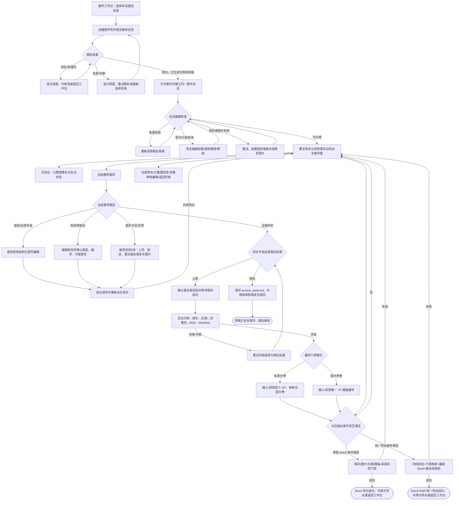

# 獬豸助手流程图评审

## 设计健康度评分

评审对象是用户提供的拟议流程图，不是当前已实现页面的视觉成品。

| # | 启发式原则 | 得分 | 关键问题 |
|---|---|---:|---|
| 1 | 系统状态可见性 | 1 | 缺解析、保存、图片绑定、归档阶段和导出状态 |
| 2 | 系统与现实世界匹配 | 2 | 介质编号、压缩和完成顺序不符合实际办理 |
| 3 | 用户控制与自由 | 0 | 无任意待办、完整编辑、返回和安全退出 |
| 4 | 一致性与标准 | 1 | 两次询问立即压缩，第一次分支又无条件汇合 |
| 5 | 错误预防 | 1 | 缺来源、租约、保存、日期、图片、介质门控 |
| 6 | 识别优于回忆 | 1 | 无历史摘要和已整理信息 |
| 7 | 灵活性与效率 | 0 | 固定顺序并重复询问已有值 |
| 8 | 美观与极简 | 2 | 单向清楚但过长且无阶段分组 |
| 9 | 错误识别与恢复 | 0 | 几乎没有失败与恢复路径 |
| 10 | 帮助与说明 | 1 | 缺格式、影响和恢复说明 |
| **总分** | | **9/40** | **严重** |

## 设计特异性结论

领域名词具体，但交互模型仍是换皮式线性表单向导。它没有表达本产品真正特有的动态待核对投影、同一案件会话、自动保存、来源与编辑租约、异步图片绑定、后台归档阶段、GP/YP 映射和双导出合同。

确定性扫描对 `packages/frontend/src/pages/CaseRecordGeneratePage.tsx` 返回 0 项发现；这只说明目标 TSX 没有命中常见机械反模式，不能证明状态机、异步语义、恢复能力和跨组件可访问性正确。浏览器没有运行中的目标页面，且可靠呈现需要有效 caseId、草稿、租约和后端状态，因此未伪造案件或注入覆盖层，改用源码、CSS、测试入口和流程图作为备用证据。

## 总体印象

图的阅读方向清楚，也抓住了解析、检材、图片和压缩几个关键词，但把一个异步、可恢复、动态派生的案件工作流错误压成固定问答链。最大机会是把“助手推进步骤”改为“助手投影当前事实并推荐一个可办理事项”。

## 有效之处

- 助手提示、用户输入和判断使用不同图形，基本角色分工可读。
- 已意识到检材完整性需要闭环核对。
- 自动解析和图片导入被识别为系统与用户协作节点。

## 优先问题

### [P0] 压缩选择被误画成任务终态

“已选择立即压缩”不等于归档完成，更不等于文件已导出。终态必须区分草稿安全保存、单独 Word 导出成功和统一导出成功。

### [P1] 固定问题顺序与动态待办机制冲突

现有实现只根据当前 `InspectionReport`、`FieldState`、生命周期、来源、租约、图片和归档事实派生缺失、无效、待确认或恢复事项。已由报告或默认设置提供的信息不得机械重复确认。

### [P1] 压缩、介质编号与并行关系错误

图中两次询问是否立即压缩，且第一次的是/否都进入介质编号。实际应为：立即压缩先做来源风险确认与保存，再进入后台 queued/archiving；稍后压缩保留案件。介质号可提前填写但不是 deferred 分支的强制下一步；最终按 optical_disc 使用首个 GP 映射全部分卷，或按 hard_drive 使用唯一 YP。

### [P1] 缺少关键恢复状态

图未覆盖解析失败、来源失效、租约只读/过期、revision 冲突、自动保存失败、图片上传/绑定失败、归档中断、介质格式错误、目录选择取消和导出失败。

### [P1] 检材与图片被错误建模为自由文本

检材需要结构化核对编号、手机/平板类型、可提取性和无法提取原因；无法在对话框中依靠“检材()”自由文本可靠生成。图片要求每项检材两个明确槽位，并区分数量不足、上传中、绑定成功、失败和多余图片。

## 认知负荷

失败 5/8：缺少分块、分组、视觉层级、工作记忆支持和渐进式披露，属于高认知负荷。问题不是单节点选项太多，而是超长主线、隐藏的并发状态、必须记忆先前输入，以及错误地重复展示无需处理的信息。

## 情绪历程

上传与自动解析带来安心；过早的压缩决策造成第一次焦虑；固定逐题询问形成疲劳；开放式检材补录循环形成第二次焦虑；“图片完成”制造虚假峰值；最后在没有任何可用输出时结束，破坏峰终体验。

## 用户角色风险信号

- Jordan（首次用户）：不知道 GP/YP、两次压缩选择的区别，也找不到返回、摘要或下一步输出。
- Alex（熟练用户）：被迫重复确认已有字段，不能任意跳转待办或直接进入完整编辑，后台压缩也被画成阻塞。
- Riley（压力测试用户）：解析失败、多标签租约、图片绑定失败、来源失效、归档中断和盘号冲突都没有恢复边，最容易出现“显示完成但没有文件”。

## 应与流程图分开评估的现有实现风险

- 自动保存 `failed/conflict` 与恢复能力没有完整接到页面状态 UI。
- 图片读取异常可能被吞掉并以空图片继续 Word 导出。
- guided/full 模式切换缺少明确焦点落点；展开按钮缺 `aria-controls`。
- 小屏工具按钮最小高度 34px，需要触控与缩放复核。
- living spec 将“獬豸”误写为“獙豸”，与 delta spec 和界面代码不一致。

## 建议状态模型

历史处理轨迹只应是当前事实的会话级展示投影，不应变成新的持久化聊天记录或第二套业务状态机。

## 次要观察

- “展示压缩信息”语义过泛：压缩前只能显示计划/风险，RAR、MD5、实际卷数必须在后台处理后形成。
- 图中“用户导入图片→已完成”缺少异步绑定完成条件。
- “检材是否完整”的否分支应打开结构化编辑器，而不是要求用户输入一段可自由解释的文本。
- 应把用户操作、助手推荐、后台系统和导出门控画成泳道，而不是全部放在同一纵向列。

## 待考虑问题

- 第一版要优先修正哪一层：业务状态机、异常恢复，还是獬豸角色与对话文案？
- 交付范围是只更新流程图与需求，还是把现有实现中保存/图片/焦点问题也纳入同一变更包？
