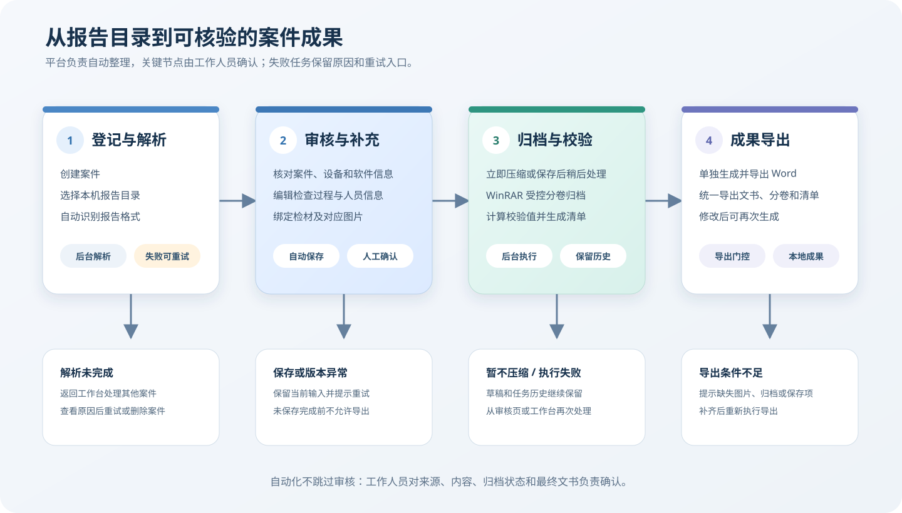

# 笔录自检平台（文枢）

<p align="center">
  
</p>

面向电子数据检查业务工作人员的本地化辅助平台。文枢把报告登记、结构化解析、笔录审核、检材图片整理、归档压缩和 Word 导出串联到同一案件工作台，减少重复录入，同时保留人工复核与修改环节。

> 文枢用于辅助整理与生成材料，不替代工作人员对报告来源、案件内容、归档结果和最终文书的审核确认。

## 使用流程



1. **进入案件工作台**：创建案件并选择本机报告目录。平台登记来源后启动解析，任务进度会保留在工作台中。
2. **解析并形成草稿**：平台识别支持的报告格式，提取案件、设备和软件信息。解析中可返回工作台继续处理其他案件；失败时可查看原因并重试。
3. **审核与补充**：工作人员在案件审核页校对字段，维护检查人员、设备、检查过程和附件信息，并为每份检材绑定对应图片。草稿会在取得编辑租约后自动保存。
4. **选择压缩时机**：可立即启动后台归档，也可先保存草稿、稍后从工作台继续。归档开始前需确认来源目录不再变化。
5. **完成归档与校验**：平台通过 WinRAR 执行受控分卷，计算校验值并生成 `ArchiveManifest`；归档失败或中断时保留任务历史，可按界面提示重试。
6. **导出成果**：审核页支持单独导出 Word；案件满足归档与附件门控后，可从工作台统一导出 Word、归档分卷及清单。导出后仍可继续修改并再次生成。

## 核心能力

| 环节 | 已实现能力 |
|---|---|
| 案件管理 | 持久化多案件工作台、解析任务状态、草稿保存、案件删除与恢复处理 |
| 报告解析 | 新旧报告格式自动检测，提取案件信息、设备列表和软件版本 |
| 在线审核 | 全文预览与编辑、检查人员和设备管理、共享默认值、主软件确认 |
| 附件整理 | `MaterialPhotoGroup` 检材—图片显式绑定，`AttachmentPlan` 统一规划附件 1/2/3 |
| 归档处理 | 后台压缩、受控分卷、光盘序列、连续性检查、校验值与 `ArchiveManifest` |
| 文书生成 | `current-template-v1` 模板配置、OOXML/VML 渲染、模板指纹和输出卫生检查 |
| 成果导出 | 单独 Word 导出与案件统一导出，导出前校验保存、图片和归档状态 |

## 使用边界与注意事项

- 当前正式输出仍由 `InspectionReport` 兼容管线生成，并消费最终的 `ArchiveManifest`、`AttachmentPlan` 和 `current-template-v1` TemplateProfile。
- 开始压缩后，不要修改、移动或删除来源目录，也不要继续向其中写入数据。
- 图片缺失、检材映射无效、草稿未保存或版本冲突时，平台会阻止不完整的 Word/统一导出。
- WinRAR 不随便携包分发；使用者需从官方渠道自行安装并按许可使用。
- 案件数据、生成文书和归档产物保存在本地运行环境中，不属于仓库资产，不应提交到 Git。

## 当前工程状态

### 正式生产链路

- `InspectionReport` 兼容审核与正式输出
- `ArchiveContext` 归档规划和 WinRAR 执行
- `ArchiveManifest`、光盘序列与校验值生成
- `MaterialPhotoGroup` 和 `AttachmentPlan`
- `current-template-v1` 的 OOXML/VML 受控渲染

### 迁移中

- `CanonicalInspectionCase`：统一内部模型已有基础实现，尚未接入正式输出。
- `pipeline_mode`：支持 legacy/shadow/canonical 集中配置；当前默认仍为 legacy。
- Shadow：生产旁路已接线，只生成脱敏诊断，不生成第二份正式产物，也不阻塞 Legacy；真实样本差异仍在治理。
- `DocumentRenderPlan`、通用 `ReportProfile` / `TemplateProfile`：属于后续演进方向，尚未成为生产合同。

Canonical 在补充验收通过或发布负责人明确接受风险前，不会成为默认且唯一的正式输出。

## 技术栈

| 层 | 技术 |
|---|---|
| 前端 | React 18、TypeScript、Ant Design 5、Vite |
| 后端 | FastAPI、Python 3.11 |
| 文档渲染 | python-docx + lxml（主路径），officecli（旧版回退） |
| 报告解析 | BeautifulSoup4 |
| 归档压缩 | WinRAR CLI |
| 存储 | 本地文件系统 |

## 快速开始

### Windows 便携版

正式便携包通过 `npm run build:portable` 构建。发布物包含冻结后端、生产前端、私有 Node/officecli、内置模板和 HashMyFiles，不包含 WinRAR 或案件数据。

解压 ZIP 后双击 `文枢.exe`。应用启动后驻留系统托盘，可从托盘重新打开或安全退出；持久数据统一写入 `%LOCALAPPDATA%\文枢`。

### 本地开发

环境要求：Node.js >= 18、pnpm >= 9、Python >= 3.11；需要验证归档流程时还需安装 WinRAR。

```bash
# 安装前端与工作区依赖
pnpm install

# 安装后端依赖
cd packages/backend
pip install -r requirements.txt

# 返回仓库根目录后同时启动前后端
pnpm dev
```

开发地址：前端 `http://localhost:30000`，后端 `http://localhost:30010`。

也可以分别启动：

```bash
pnpm --filter @biji/frontend dev
pnpm --filter @biji/backend dev
```

## 工程验证

```bash
pnpm verify:quick          # 架构、类型、治理文档和仓库资产检查
pnpm verify:frontend       # 前端类型检查与测试
pnpm verify:backend        # 后端测试
pnpm verify:full -- --change <变更包名称>  # 当前变更范围的完整门控
pnpm verify:full:all       # 全局发布或集中归档门控
```

命令以根目录 `package.json` 为唯一事实源。详细验证策略见 `harness/verification-strategy.md`。

## 项目结构与资产安全

- 目录结构：`harness/directory.md`
- 架构约束：`harness/architecture.md`
- 仓库资产政策：`harness/repository-assets.md`
- 工程工作流：`AGENTS.md` 与 `harness/iteration-guide.md`
- 现行需求规格：`openspec/specs/`

所有测试数据必须明确标记为 `SYNTHETIC`、`TEST` 或 `FIXTURE`。真实案件数据、人员信息、设备标识、生成文书、解析结果和归档产物不得进入仓库。

## 许可证

内部使用。
