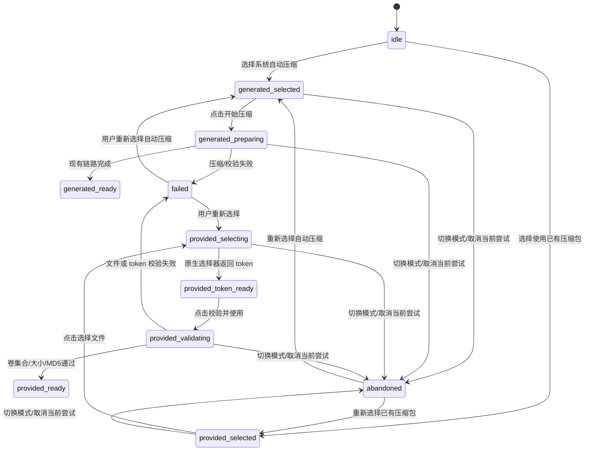

# Design: 归档来源选择与已有压缩包复用

> 变更：`archive-source-selection`
> 目标：在不改变 Legacy Word 输入合同的前提下，把归档准备从隐式自动触发改为显式选择，并安全复用用户已经准备好的单卷或新式分卷文件。

## 1. 设计边界

本设计只扩展“审核编辑 → 归档准备 → 正式导出前复核”这条 Legacy 链路。报告解析、Word 模板/VML/分页、Legacy 主渲染、Shadow 和 Canonical 均保持现状。用户提供模式只读取压缩包外部文件元信息和字节流，不解压，也不核对压缩包内部文件与报告目录的逐文件一致性。

系统自动压缩和用户提供归档是两个明确的执行分支：用户提供分支不会调用 WinRAR 压缩执行器；自动分支继续使用现有规划、WinRAR 执行、完整性校验和 Manifest 组装流程。

## 2. 分层落点

| 层级 | 设计职责 | 计划落点 |
|---|---|---|
| SharedTypes / Constants | 归档模式、选择摘要、稳定错误码和新增 API 请求类型；不改 `ArchiveManifest` | `packages/shared/types/archive.ts`、`packages/shared/constants/index.ts` |
| Backend Repository | Windows 原生选择器适配、token 运行时存储、路径授权、同目录卷发现和文件清单读取 | `packages/backend/app/repository/archive_selection_repository.py`、现有 `archive_authorization_repository.py`、`archive_validator_repository.py` |
| Backend Services | 选择流程、用户提供归档校验、流式 MD5、Manifest 来源记录、导出前复核 | `packages/backend/app/services/archive_provided_selection_service.py`、`archive_provided_archive_service.py`、现有 `archive_manifest_service.py`、`archive_manifest_access_service.py`、`archive_runtime_models_service.py` |
| Backend Controller | 选择器和归档执行请求的模式分发、token/文件错误映射 | `packages/backend/app/controllers/archive_controller.py` |
| Frontend Hooks | 显式状态机、attempt ID、取消和迟到响应隔离 | `packages/frontend/src/hooks/useArchivePreparation.ts` |
| Frontend Components / Pages | 归档方式选择、选择文件、校验并使用、开始压缩和重新准备确认 | `ArchiveStatusCard.tsx`、`RecordEditorForm.tsx`、`RecordGeneratePage.tsx` 及必要的新组件 |
| Word | 仅增加回归测试；不修改渲染实现和模板资产 | 现有 `attachment_plan_service.py`、`template_filler_service.py` 测试 |

执行顺序遵循 SharedTypes → Repository → Services → Controller → Hooks → Components → Pages；每个核心实现任务后紧跟对应测试任务。

## 3. 公共 Manifest 合同决定

### 3.1 首版不增加 `ArchiveManifest.source`

首版保持现有公共 `ArchiveManifest` 结构不变。原因是两种归档方式都必须向 Word 提供同一个已验证的 `parts[]` 合同，而当前页面已经知道用户选择的模式；Word、Legacy Controller、外部 Manifest 消费者不需要用公共字段区分来源。仅为了满足内部运行时审计而向公共 Schema 添加字段，会扩大 API、持久化和兼容测试面。

用户提供模式的内部记录增加以下语义字段，但不出现在 `public_manifest`、前端响应或自动归档持久化索引：

| 内部字段 | 语义 |
|---|---|
| `source_mode` | `generated` 或 `user_provided` |
| `source_record_id` | 不透明的会话级来源记录 ID |
| `part_paths` / 受保护来源引用 | 仅用于后端重新 stat/hash 和下载，绝不序列化到公共合同 |
| `cleanup_policy` | `system_owned` 或 `user_owned_no_delete` |

如果未来前端必须跨页面展示来源、外部 API 必须分流、或持久化审计合同要求来源字段，应单独提出公共合同变更；本变更不预留一个会被误用的可选 `source` 字段。

### 3.2 新增的请求合同不等同于 Manifest 扩展

现有归档执行请求增加 `archive_mode`：

```text
archive_mode: "generated" | "user_provided"
selection_token: string  // 仅 user_provided 必填
```

新增选择接口返回：

```text
selection_token: string
display_parts: [{ filename: string, part_number: number }]
part_count: number
expires_at: string
```

`display_parts[].filename` 只保留脱敏后的文件名，不包含父目录、盘符或其他路径信息。`POST /records/archive` 的成功响应继续返回现有公共 Manifest 结构；错误响应使用稳定错误码和脱敏文件名。

## 4. 本机文件选择、授权和 token

### 4.1 选择器可行性结论

普通浏览器的 `<input type=file>` 或 File System Access API 只能向网页提供 `File`/句柄语义，不能把后端可直接打开的真实本机绝对路径交给普通 HTTP 服务。因此首版采用本地可信环境方案：

1. 前端调用 `POST /records/archive/selections/pick`，请求只带当前归档上下文和会话关联信息。
2. 后端在独立的 Windows 原生选择器适配器中调用 common file dialog；选择器运行在后端所在的交互式 Windows 会话，而不是浏览器进程中。
3. 后端立即对所选锚点路径做授权和 reparse point 检查，创建内存中的来源记录，返回 opaque token 和脱敏卷摘要。
4. 前端点击“校验并使用”时，只提交 token 和报告/上下文数据；后端从来源记录取得原始路径并直接读文件。

该方案仅在浏览器与 FastAPI 后端位于同一台、同一交互式 Windows 会话且服务具有桌面访问能力时可行。当前部署若以 `0.0.0.0` 监听或作为无桌面服务运行，选择器接口必须额外要求本地/受信任环境能力，不得让远程浏览器诱导服务打开任意路径。远程或 headless 环境返回 `native_picker_unavailable`；只有开发/明确降级配置才允许手工输入路径，并复用现有授权根、绝对路径、目录隔离和 reparse point 安全校验。首版不引入完整桌面应用壳。

### 4.2 Token 设计

- token 使用密码学随机的不透明值；后端只保存 token 摘要和内部来源记录，不保存可逆 token 明文。
- TTL 采用短时限，首版默认不超过 5 分钟；记录同时绑定当前会话、`archive_context_id` 和选择器能力实例。
- token 在进入“校验并使用”时原子消费，校验失败、请求异常或取消后均要求重新选择，避免同一外部文件被重复提交为多个会话归档。
- 服务重启只丢失内存记录；token 过期、上下文不匹配、消费过或来源记录不存在都统一拒绝，不回退到 Manifest 或自动索引中的路径。
- 日志只记录内部不可逆记录 ID、错误码和脱敏文件名；不记录 token 明文、绝对路径、盘符或完整用户文件名路径。Manifest、前端响应、Git 和持久化自动归档索引同样不出现原路径。

### 4.3 路径安全

首版复用现有路径授权边界：必须是绝对本地路径、位于批准的根目录内且不位于解析缓存/系统输出目录；拒绝 UNC、设备路径、越界路径、符号链接或 reparse point。锚点父目录和发现出的每个卷都重新检查，不能只验证用户最初点击的文件。

用户原文件的来源记录使用 `cleanup_policy=user_owned_no_delete` 和 `cleanup_root=None`。所有清理逻辑只允许删除系统创建且带有系统所有权标记的临时目录。

## 5. 归档来源状态机

页面状态和已完成 Manifest 分离：`active_manifest_id` 表示当前仍可用于导出的正式结果，`attempt_id` 表示当前显式准备尝试。报告字段变化只更新报告，不改变归档尝试状态。



状态规则：

- 初始状态为 `idle`；不能以光盘编号有效作为准备条件。
- `generated_selected` 和 `provided_selected` 只表示模式已选，不发送网络请求。
- 每次显式执行分配新的 `attempt_id`。前端以 `AbortController`/请求序号取消或忽略旧请求；后端也按上下文、来源模式和运行时记录隔离迟到结果。
- 进入 `generated_ready` 或 `provided_ready` 时创建新 Manifest ID，并将它作为新的候选/正式结果；旧的有效 `active_manifest_id` 不被原地修改。
- 已有有效 Manifest 时点击模式入口先要求“重新准备归档”确认。未确认前只显示现有结果，不创建新请求。
- 运行时记录为 `completed` 并不意味着用户提供文件永久有效；每次正式导出仍必须执行第 7 节的来源复核。

## 6. 用户提供卷集合算法

1. 对用户选择的 basename 做大小写不敏感解析：`name.rar` 是单卷；`name.partN.rar` 是新式分卷；`.r00`/`.r01` 先返回旧式格式错误。
2. 将选择文件的父目录作为唯一搜索目录，禁止递归。
3. 对目录中同 base 的候选 `.rar` 文件做规范化：要求单卷模式只有 `name.rar`，分卷模式只有 `name.partN.rar`，序号从 1 开始且不带前导零；任何无法归入唯一模式的同 base RAR 都是额外或混合文件，直接拒绝。
4. 规范化后检测重复逻辑卷号，要求集合正好为 `1..M`；缺少任一序号返回 `part_missing`，重复返回 `duplicate_part`。
5. 对最终有序集合逐卷执行授权、普通文件、可读性和 reparse point 检查，再读取大小和 MD5。文件系统枚举顺序不影响结果。

该算法不读取 RAR header，不依赖 WinRAR 才能确定文件名、大小、MD5、单卷/分卷和卷顺序；WinRAR `t` 如果启用只作为附加诊断。

## 7. Manifest 组装和导出复核

用户提供服务应复用现有 Manifest 组装和字段验证逻辑，但把“文件在哪里”从 `final_dir / filename` 抽象成内部来源读取器：自动归档来源解析到系统拥有的归档输出目录，用户提供来源解析到会话级 `part_paths`。两者都先生成同样的 `ArchiveManifest.parts[]`，再进入现有 Legacy Word 链路。

每卷读取协议：

1. 读取前 stat，记录文件身份、大小和允许的安全属性。
2. 用有界 buffer 流式读取，计算 MD5 和读取字节数。
3. 读取后 stat；身份或大小变化返回 `part_changed`。
4. 所有卷完成后，在 Manifest 发布前再次 stat，确认每卷仍与刚计算的结果一致。
5. 正式导出入口再次通过内部来源读取器校验每卷存在、大小和 MD5；缺失返回 `part_missing`，变化返回 `part_changed`，任何失败均阻止导出。

用户提供分支不得调用 `archive_execution_service.execute_archive` 中的 WinRAR 压缩步骤，也不得写入 `output/compressed/.archive-manifest-index.json`。系统自动分支继续使用现有生成目录、持久化索引、规划和 WinRAR 流程。

## 8. 错误映射和可观测性

Controller 只向前端返回稳定错误码、脱敏文件名和可操作提示，不返回异常堆栈或绝对路径。首版至少固定以下错误码：

| 错误码 | 前端提示方向 |
|---|---|
| `native_picker_unavailable` | 当前部署无法调用本机选择器 |
| `selection_cancelled` | 用户取消选择 |
| `selection_token_invalid` / `selection_token_expired` | 重新选择压缩包 |
| `archive_path_unauthorized` | 文件不在允许的本机范围 |
| `unsupported_archive_format` | 仅支持 `.rar` 或 `.partN.rar` |
| `unsupported_legacy_volume_format` | 不支持 `.r00/.r01` 旧式分卷 |
| `part_missing` | 指定卷缺失，显示缺失卷名/序号 |
| `duplicate_part` | 发现重复卷号 |
| `mixed_archive_parts` / `extra_archive_part` | 集合命名不唯一 |
| `part_unreadable` | 某卷不可读 |
| `part_changed` | 文件在校验或导出前发生变化 |
| `archive_manifest_invalid` | Manifest 字段或连续性校验失败 |

日志可以使用 `attempt_id`、内部记录 ID 和错误码关联一次请求，但不记录原始路径。性能指标可记录卷数、总字节数、耗时和结果，不记录文件内容或路径。

## 9. Word、Legacy、Shadow、Canonical 隔离

- `attachment_plan_service` 仍只消费已验证公共 Manifest 的 `parts[]`；文件名、大小、MD5、分卷号、光盘号、光盘日期和光盘容量的字段名及顺序不变。
- 不修改正式 Word 模板、VML、分页规则、`template_filler_service` 主渲染逻辑和 Legacy 报告解析；只增加合成 Manifest 的回归测试，证明两种来源映射结果相同。
- 不把 `source_mode` 加入 Shadow 差异输入，不建立 Shadow 与用户本机路径的比较；不修改 Canonical 类型、路由或正式切换开关。
- Legacy 是唯一正式输出消费者；用户提供文件的路径和 token 只存在于归档运行时安全边界。

## 10. 测试和发布策略

测试使用带 `SYNTHETIC`/`TEST`/`FIXTURE` 标记的临时小文件。RAR 文件名可以是合成 fixture 名称，不需要真实大体积压缩内容；WinRAR 能力通过 fake runner 注入，不执行真实 GB 级压缩。

发布前必须有单元、集成和前端交互测试覆盖 proposal/spec 中的所有错误边界；还要有自动模式回归、Word 字段映射回归和服务重启/缓存清理不复用来源的测试。由于本变更是 Level 3，实施完成后还需按项目流程执行完整 verify、独立 review 和 archive；本轮只生成文档并执行用户指定的定向检查。

## 11. 关键决策、理由和拒绝的备选方案

### D-001：用显式状态机替代自动 effect

- 决策：归档方式未选择时保持 `idle`；只有按钮动作才创建准备尝试。
- 理由：光盘编号是报告字段，不是用户授权系统开始压缩的信号；显式动作可以消除自动压缩与已有文件校验的竞争。
- 拒绝备选：继续在 `useEffect` 中监听报告/光盘编号，或仅增加一个“跳过压缩”开关；这两种方式仍会在用户没有明确确认时派发请求。

### D-002：后端 Windows 原生选择器优先，浏览器上传不作为首版

- 决策：由后端交互式 Windows 进程调用 common file dialog，前端只取得 token 和脱敏摘要。
- 理由：后端需要直接读取本机原文件，避免复制数 GB 文件、临时磁盘占用和上传中断；浏览器文件选择能力不能安全提供后端可用的绝对路径。
- 拒绝备选：用 `<input type=file>`/File System Access API 上传到后端；它们提供的是浏览器 File/句柄，不是后端可打开的路径，而且会复制全部文件。完整桌面壳暂不建设，因为当前首要目标可由本地可信环境完成。

### D-003：选择 token 存内存、短 TTL、一次消费

- 决策：token 绑定会话和归档上下文，后端只保存摘要和受保护来源记录，默认 TTL 不超过 5 分钟，在第一次校验尝试时原子消费。
- 理由：降低路径授权长期有效、跨会话复用和重复提交风险；服务重启后自然要求重新选择。
- 拒绝备选：把绝对路径编码到前端或 Manifest；会形成路径泄露和不可控复用。把选择记录写入自动归档持久化索引；会污染 generated 版本和清理语义。

### D-004：沿用现有归档入口，内部使用分支服务

- 决策：在现有 `POST /records/archive` 增加 `archive_mode`/token 请求字段，并由 Controller 将 `generated` 和 `user_provided` 分发到不同 service；成功响应仍是公共 Manifest。
- 理由：减少外部 Word/导出合同变化，同时让用户提供模式不能意外落入 `execute_archive` 的 WinRAR 分支。
- 拒绝备选：把两个模式合并进同一个“智能执行”函数；它容易因默认参数或重试逻辑重新触发 WinRAR。完全新建一套公共 Manifest API；会扩大路由和兼容面但没有业务收益。

### D-005：文件名和卷序只依赖安全的同目录枚举

- 决策：从用户选择的任一卷解析 base，在同一父目录非递归发现 `name.rar`/`name.partN.rar`，按数字序号形成集合。
- 理由：满足业务所需的文件名、大小、MD5、顺序和缺卷判断，不需要解压或依赖 WinRAR；同目录边界也限制了扫描范围。
- 拒绝备选：递归扫描整个磁盘、猜测相邻目录或按文件时间排序；会扩大授权边界并可能混入其他归档。支持 `.r00/.r01`；本轮明确排除且难以与新式集合保持同一合同。

### D-006：WinRAR `t` 作为可选诊断，不作 Manifest 前置

- 决策：大小和 MD5 通过有界流式读取完成，`t` 只在能力开启时作为额外结果。
- 理由：本轮不要求逐文件证明压缩包内容，强制 `t` 会让已有归档再次依赖 WinRAR，且无法替代导出前的外部文件变化复核。
- 拒绝备选：先执行 `t` 或解压再生成 Manifest；会增加等待、读取和临时空间，并超出本轮校验边界。

### D-007：公共合同不加 source，内部记录保存来源

- 决策：`ArchiveManifest` 保持不变，`generated/user_provided` 只保存在会话级内部 `ArchiveManifestRecord`。
- 理由：当前前端能从选择状态展示来源，Word/Legacy 只需统一的 parts 合同；不应因为内部清理或安全需要扩大公共 Schema。
- 拒绝备选：现在直接增加可选 `ArchiveManifest.source`；除非未来确认外部 API、跨页面 UI 或审计持久化必须读取，否则该字段会被误当作公共业务事实并增加兼容负担。

### D-008：用户来源不进入自动复用索引，清理策略显式分权

- 决策：用户提供归档只存会话级来源记录，系统文件和用户文件采用不同的 cleanup policy；缓存清理只删除系统拥有的临时物。
- 理由：用户原文件由用户管理，服务不能依据自己的 TTL 或缓存回收策略删除它；自动归档索引也不应保存失效的外部路径。
- 拒绝备选：把用户文件复制进 `output/compressed` 后统一管理；会重新引入大文件复制、磁盘占用和“系统是否拥有文件”的歧义。
