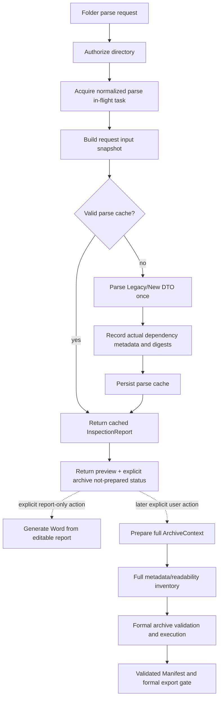

# Design: Large Report Preview Liveness

> Change: `large-report-preview-liveness`
> Status: `PROPOSED`; implementation, external real-report acceptance, and full Harness verification are complete. The dedicated synthetic benchmark and remaining final review gates are still open.
> Baseline: current Legacy DTO and formal ArchiveManifest contracts

## 1. Design boundary

This design changes the lifecycle of folder-mode preview and the timing of full ArchiveContext preparation. It does not implement Shadow, Canonical, Word template changes, or a new formal archive format.

The source of truth remains:

- `InspectionReport` for editable Legacy-compatible business data;
- the parse cache for the business preview result only;
- a full, current `ArchiveContext` plus validated `ArchiveManifest` for formal archive and Manifest-bound export evidence; report-only Word export consumes only the editable report.

This design exposes only an authorized report-directory preparation boundary.

## 2. Target request flow



The preview path ends at `J`. It may issue an opaque, short-lived context shell for later preparation, but it must not build the full inventory at that point.

## 3. Request-scoped parser input snapshot

### 3.1 Internal model

Introduce an internal request-only model in the backend repository/service boundary. It is not serialized into `InspectionReport`, frontend responses, or cache keys.

```text
ReportParseInputSnapshot
  source_key: opaque normalized directory key
  source_root: authorized internal Path reference
  data_root: authorized internal Path reference
  report_format: legacy | new
  core_json:
    case_info: parsed object
    device_lists: parsed object
    report_info: parsed object
  device_rows: ordered tuple
  evidence_directories: map<evidence_number, internal directory reference>
  parser_dependencies: ordered map<relative_path, DependencyRecord>
  dependency_fingerprint: opaque digest

DependencyRecord
  relative_path: normalized relative path
  size_bytes: integer
  modified_time_ns: integer
  stable_identity: optional filesystem identity
  content_digest: digest
```

Absolute paths are retained only in the live authorized object needed to open files. Public summaries, cache file names, log fields, and metrics use `source_key`, relative paths where explicitly safe, or counters only. The snapshot lifetime is limited to the parse task and any bounded cache write.

### 3.2 Core JSON and directory index

`detect_report_format`, `parse_device_lists`, `parse_case_info`, `parse_report_info`, and evidence-directory resolution must accept a snapshot or a preloaded input object. They must not independently reopen the three core JSON files or rescan the report root.

The directory index is built from directory metadata and the known evidence-number mapping. It is not a recursive content inventory and does not open media, attachment HTML, navigation payloads, or unrelated JSON.

### 3.3 Device candidate selection

The current Legacy `parse_device_base` behavior is a broad fallback: it opens every JSON under each selected device subdirectory. The implementation must replace that with a controlled selector:

1. Resolve only the evidence directory named by the device row.
2. Enumerate only the supported metadata subdirectories (`Base`/`Phone` semantics already understood by the parser); never recurse from the report root.
3. Select files by an explicit, test-covered Legacy metadata candidate rule. The rule may use stable filenames, directory roles, or a one-pass lightweight index, but it must not inspect arbitrary media or business data merely for cache identity.
4. If a fallback scan is required for a supported Legacy variant, the scan must stream through the candidate set once, stop as soon as all required fields are confirmed where the parser contract permits, and record every file actually read. A fallback that cannot meet the performance target must fail with a safe, diagnosable parser error rather than silently reintroduce a second full read pass.
5. The same selected input stream supplies device fields and dependency records. No separate pre-fingerprint pass may reopen those files.

The candidate rule and fallback behavior must be proven against synthetic Legacy fixtures and the external manual report. The real report is not copied into fixtures or repository assets.

## 4. Parse cache algorithm

### 4.1 Cache miss

The parse task owns one snapshot and one parser pass:

```text
authorize
  -> acquire in-flight entry
  -> load core JSON once
  -> detect format once
  -> build device-directory index once
  -> for each device, read selected JSON once
  -> update DependencyRecord while reading
  -> build DTO
  -> compute aggregate dependency fingerprint from recorded records
  -> atomically save cache payload + dependency manifest
```

The cache payload contains the existing parse result, cache version, last-access metadata, and an internal dependency manifest composed of normalized relative paths, metadata, stable identities where available, and digests. It must not contain an absolute source path or report content outside the existing result payload.

### 4.2 Cache hit

The cache service first validates the stored dependency manifest using directory membership, relative path safety, file existence, size, modification time, and stable identity when available. If all identities are unchanged, it reuses the stored digest and returns the cached DTO without opening dependency contents. If a dependency is missing or its metadata changes, only the affected dependency set is reopened and digested; the resulting aggregate digest decides whether a reparse is required.

Candidate-directory membership and the candidate index metadata are themselves dependencies. This prevents a newly added relevant metadata file from being ignored while still excluding unrelated media and attachment trees.

The existing LRU limit, cache versioning, atomic writes, corruption cleanup, and cache-clear isolation remain in force. The cache service must not call ArchiveContext cleanup or delete archive outputs.

## 5. In-flight registry

### 5.1 Ownership and key

Add a Layer 21 service-owned bounded registry keyed by the existing normalized directory identity. The normalized key is created before dependency discovery but contains no raw path. The registry entry stores:

```text
ParseInFlightEntry
  key: opaque key
  task/future: shared result holder
  state: running | succeeded | failed
  created_at / completed_at
  waiter_count
  last_observed_at
  failure: safe error only
```

The registry owns a bounded executor or equivalent shared synchronous task runner. A request awaits the shared future; request cancellation removes only that waiter. The worker is not cancelled solely because the browser disconnected, so a later retry can join the same task.

### 5.2 Lifecycle rules

- Acquire the entry before any dependency fingerprint, directory scan, Parser call, or cache write.
- A second request for the same key joins the existing future and does not call the builder.
- Successful results remain available for a short post-completion handoff window, after which the entry is removed; the persistent parse cache remains the durable reuse mechanism.
- Failed entries are removed after all waiters observe the safe failure. A retry can then start fresh.
- Running entries have a maximum lifetime and registry capacity. Expiry must mark the task failed safely and clean the entry; it must never expose a half-built report or leave a permanent lock.
- Metrics use counts, durations, state, and opaque key prefixes only.

The existing cache key lock remains useful for cache-store consistency, but it is no longer the first concurrency boundary. It must not be relied on to deduplicate the expensive dependency discovery that currently happens before the lock.

## 6. ArchiveContext shell and deferred full inventory

### 6.1 Shell semantics

Choose a context-shell design rather than exposing a new raw path handle to the browser. The parse controller may create a short-lived runtime shell containing:

- opaque `archive_context_id`;
- authorized source reference held only in memory;
- authorization type, root identity, and scope;
- case display label needed for later archive planning;
- shell status `not_prepared`;
- expiry and cleanup ownership metadata;
- no file inventory, no total byte count, no full input fingerprint, and no Manifest.

The shell ID is not evidence. `ArchiveContextSummary` must expose readiness explicitly, using nullable inventory fields or an `inventory_ready` flag rather than zero values that look authoritative. Formal execution rejects a shell with a stable `ARCHIVE_CONTEXT_NOT_PREPARED` error.

If a future implementation chooses an opaque source handle instead, it must keep the same properties: no path exposure, short TTL, authorization binding, and no formal-evidence semantics. The choice must be finalized before implementation and represented consistently in shared types and design tests.

### 6.2 Explicit preparation boundary

Add a source-neutral preparation operation, preferably a dedicated endpoint or service method, that upgrades a valid shell to a full context. It must be idempotent for the same shell/attempt while a preparation is running and must expose independent `not_prepared`, `preparing`, `ready`, and `failed` states.

The preparation operation:

1. Revalidates shell authorization and expiry.
2. Builds the complete metadata inventory without following links or reparse points.
3. Performs currentness/readability checks required by the formal archive entry point.
4. Stores the full inventory only after a complete successful build.
5. Returns a ready context summary only after inventory publication.

The current formal execution path must continue to call `verify_input_inventory`, compute the full input content fingerprint, validate the archive plan, execute WinRAR, validate archive parts, publish the Manifest, and revalidate files before download or Manifest-bound formal export. A parse snapshot or shell can never bypass those checks. Report-only Word export is a separate document-generation path and must not be treated as archive evidence.

## 7. Response and frontend contract

### 7.1 Parse response

Preserve existing `report`, `parsed_files`, and `rar_info` semantics. Add an explicit readiness contract, for example:

```text
archive_preparation_status: "not_prepared" | "preparing" | "ready" | "failed"
archive_context_id: string | null       // shell or full context, opaque
archive_context: ArchiveContextSummary | null
```

`archive_status` must not be populated with `idle` when no full context exists. If compatibility requires keeping the field, it must be documented as deprecated and paired with the explicit readiness field; consumers must use the readiness field.

The exact field name and nullable summary shape must be finalized in the SharedTypes task before implementation. No absolute path or report-content diagnostic may be added.

### 7.2 Frontend behavior

`useReportParser` owns preview loading/error/retry. `useArchivePreparation` owns only explicit context preparation and later archive execution. `usePreviewArchive` becomes passive: it resets to `not_prepared` on a new report and does not start a request from an effect.

The review page displays a clear archive-not-prepared status and keeps report editing available. The user may explicitly export a Word report before archive preparation; this path does not start WinRAR or claim a Manifest. Manifest-bound formal archive export remains blocked until a ready context and validated Manifest are present. Preview timeout/network failure ends preview loading; archive preparation has separate loading and error cleanup.

### 7.3 Word export modes

The export Controller distinguishes two explicit cases:

- Report-only Word export: no archive context/Manifest is supplied. It runs the existing report validation and DOCX renderer with the editable report, without archive execution or Shadow formal-export observation.
- Manifest-bound formal export: both an opaque context and Manifest identifier are supplied. It performs the existing complete Manifest validation and formal gates before rendering.

A partial archive identifier is not treated as report-only; it fails with a stable missing-Manifest error. The frontend sends archive identifiers only when both are ready.

## 8. Layered implementation map

| Layer | Responsibility | Constraints |
|---|---|---|
| 0-1 | Readiness status, nullable shell summary, preparation endpoint constants | No Manifest schema change |
| 10-12 | Passive preview, explicit preparation state, accurate export gate | Hooks cannot import backend services; no auto archive effect |
| 20 | Snapshot, candidate index, dependency metadata/digest reads | No response assembly or service orchestration |
| 21 | Parser orchestration, in-flight registry, shell and materialization lifecycle | May depend on Repository, not Controller or Routes |
| 22-23 | Safe endpoint parameter mapping and response/error construction | No filesystem traversal in Controller; no raw paths in response |

All new files must use named exports/normal Python module exports, remain within the repository file-size rule, and have tests in the corresponding layer. No new directory is required outside the change package and existing source/test directories.

## 9. Alternatives considered

### D-001: Do not extend the timeout

- Decision: keep the frontend timeout contract unchanged while making the backend task shareable and the preview path lightweight.
- Reason: a longer timeout does not remove duplicate reads, ArchiveContext inventory cost, or retry races.
- Rejected: changing 120 seconds to several minutes; it preserves the bad critical path and worsens user feedback.

### D-002: Request-scoped snapshot plus one-pass dependency registration

- Decision: core inputs and actual dependency records live in one parse task and feed both DTO construction and cache persistence.
- Reason: it removes the measured “fingerprint then Parser” duplicate read and makes the cache dependency contract explicit.
- Rejected: keeping `parse_device_base` and adding another cache around it; overlapping caches would still reopen files and make invalidation ambiguous.

### D-003: Metadata-first cache validation

- Decision: unchanged dependency metadata reuses stored digests; only changed dependencies are reopened.
- Reason: cache hits should not reread or rehash thousands of unchanged JSON files.
- Rejected: full directory content fingerprint on every request; it includes irrelevant data and was measured as a major portion of the timeout.

### D-004: In-flight registry before fingerprinting

- Decision: share a bounded future before all expensive work.
- Reason: the existing cache key lock is acquired after dependency fingerprinting, so it cannot prevent concurrent timeout retries from duplicating that work.
- Rejected: relying only on frontend `useRef` or only on the cache-store lock; neither survives a browser Abort at the backend boundary.

### D-005: Explicit shell plus later full context

- Decision: use an opaque readiness-aware shell or equivalent source handle, then materialize full inventory only at explicit archive preparation.
- Reason: preview needs an authorized continuation reference but not a 141,209-file inventory; formal archive must still use a fresh complete inventory.
- Rejected: creating a full context during parse and simply marking it idle; that misrepresents readiness and preserves the measured 115-second delay.

## 10. Observability and privacy

Record only phase names, counts, durations, readiness state, cache hit/miss, in-flight join/start/finish, and stable opaque identifiers. Do not log absolute paths, case names, device identifiers, JSON contents, cache payloads, or user-owned archive paths. Real manual acceptance uses the external report locally and produces no repository, test, documentation, or Git asset.

## 11. Rollback and failure behavior

- Keep the old full-context path behind a controlled compatibility flag only during rollout if needed; do not use it as the default preview path after acceptance.
- If snapshot candidate selection fails, return a safe parse error and leave no partial cache entry; do not silently fall back to a full unbounded scan in production.
- If shell materialization fails, preserve the editable preview and expose a retryable archive-preparation error.
- If in-flight capacity is exhausted, reject new work with a stable retryable error; do not evict a running task.
- Rollback must not delete parse caches, original report directories, RAR/Manifest outputs, or user-owned files.

## 12. Validation strategy

Automated tests use only synthetic fixtures marked `SYNTHETIC`, `TEST`, or `FIXTURE`. They cover read counters, candidate selection, dependency invalidation, concurrent waiters, cancellation, shell readiness, full-inventory enforcement, and Legacy/New DTO parity. Manual acceptance runs the previously measured external multi-material report only on the local machine; the path and business data are never written to repository files, logs, tests, or docs.
