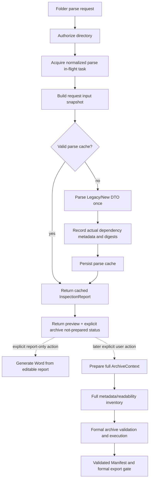

# 设计：大型报告预览活性

> 变更：`large-report-preview-liveness`
> 状态：`PROPOSED`；实现、外部真实报告验收和完整 Harness 验证已经完成。专用合成基准和其余最终审查门控仍未完成。
> 基准：当前 Legacy DTO 和正式 ArchiveManifest 契约

## 1. 设计边界

本设计改变文件夹模式预览的生命周期和完整 ArchiveContext 准备时机。它不实现 Shadow、Canonical、Word 模板变更或新的正式归档格式。

事实源保持不变：

- 可编辑且兼容 Legacy 的业务数据使用 `InspectionReport`；
- 解析缓存只保存业务预览结果；
- 正式归档和 Manifest 绑定的导出证据使用完整、当前的 `ArchiveContext` 加已验证 `ArchiveManifest`；仅报告 Word 导出只消费可编辑报告。

本设计只公开已授权报告目录的准备边界。

## 2. 目标请求流程



预览路径在 `J` 结束。它可以签发供以后准备使用的不透明短期上下文外壳，但此时不得构建完整清单。

## 3. 请求范围的解析器输入快照

### 3.1 内部模型

在后端存储库/服务边界引入仅供内部请求使用的模型。它不会序列化到 `InspectionReport`、前端响应或缓存键中。

```text
ReportParseInputSnapshot
  source_key: opaque normalized directory key
  source_root: authorized internal Path reference
  data_root: authorized internal Path reference
  report_format: legacy | new
  core_json:
    case_info: parsed object
    device_lists: parsed object
    report_info: parsed object
  device_rows: ordered tuple
  evidence_directories: map<evidence_number, internal directory reference>
  parser_dependencies: ordered map<relative_path, DependencyRecord>
  dependency_fingerprint: opaque digest

DependencyRecord
  relative_path: normalized relative path
  size_bytes: integer
  modified_time_ns: integer
  stable_identity: optional filesystem identity
  content_digest: digest
```

绝对路径只保留在打开文件所需的实时授权对象中。公共摘要、缓存文件名、日志字段和指标仅使用 `source_key`、明确安全的相对路径或计数器。快照生存期仅限解析任务和有界缓存写入。

### 3.2 核心 JSON 和目录索引

`detect_report_format`、`parse_device_lists`、`parse_case_info`、`parse_report_info` 和证据目录解析必须接受快照或预加载输入对象。它们不得分别重新打开三个核心 JSON 文件或重新扫描报告根目录。

目录索引从目录元数据和已知证据编号映射构建。它不是递归内容清单，也不会打开媒体、附件 HTML、导航载荷或无关 JSON。

### 3.3 设备候选选择

当前 Legacy `parse_device_base` 行为是一种宽泛回退：它会打开所选设备子目录下的每个 JSON。实现必须用受控选择器替换它：

1. 只解析设备行指定的证据目录。
2. 只枚举受支持的元数据子目录（解析器已理解的 `Base`/`Phone` 语义）；绝不从报告根目录递归。
3. 按经过测试覆盖的明确 Legacy 元数据候选规则选择文件。规则可使用稳定文件名、目录角色或单遍轻量索引，但不得仅为缓存身份检查任意媒体或业务数据。
4. 如果受支持的 Legacy 变体需要回退扫描，扫描必须单次流式遍历候选集，在解析器契约允许且所有必需字段都已确认时立即停止，并记录实际读取的每个文件。无法满足性能目标的回退必须以安全、可诊断的解析器错误失败，不得静默重新引入第二次完整读取。
5. 同一所选输入流同时提供设备字段和依赖记录。不得通过单独的预指纹遍历重新打开这些文件。

候选规则和回退行为必须通过合成 Legacy 固件和外部人工报告证明。真实报告不得复制到固件或仓库资产中。

## 4. 解析缓存算法

### 4.1 缓存未命中

解析任务拥有一个快照和一次解析器遍历：

```text
authorize
  -> acquire in-flight entry
  -> load core JSON once
  -> detect format once
  -> build device-directory index once
  -> for each device, read selected JSON once
  -> update DependencyRecord while reading
  -> build DTO
  -> compute aggregate dependency fingerprint from recorded records
  -> atomically save cache payload + dependency manifest
```

缓存载荷包含现有解析结果、缓存版本、最后访问元数据，以及由规范化相对路径、元数据、可用的稳定身份和摘要组成的内部依赖清单。除现有结果载荷外，不得包含绝对源路径或报告内容。

### 4.2 缓存命中

缓存服务首先使用目录成员关系、相对路径安全性、文件存在性、大小、修改时间及可用的稳定身份验证已存依赖清单。如果所有身份未变化，则复用已存摘要，并在不打开依赖内容的情况下返回缓存 DTO。如果依赖缺失或元数据变化，只重新打开受影响依赖集并计算摘要；结果聚合摘要决定是否需要重新解析。

候选目录成员关系和候选索引元数据本身也是依赖。这可防止忽略新增的相关元数据文件，同时仍排除无关媒体和附件目录树。

现有 LRU 限制、缓存版本控制、原子写入、损坏清理和缓存清除隔离继续有效。缓存服务不得调用 ArchiveContext 清理或删除归档输出。

## 5. 执行中注册表

### 5.1 所有权和键

增加由第 21 层服务拥有、以现有规范化目录身份为键的有界注册表。规范化键在依赖发现前创建，但不含原始路径。注册表条目保存：

```text
ParseInFlightEntry
  key: opaque key
  task/future: shared result holder
  state: running | succeeded | failed
  created_at / completed_at
  waiter_count
  last_observed_at
  failure: safe error only
```

注册表拥有有界执行器或等价的共享同步任务运行器。请求等待共享 Future；取消请求只移除该等待方。工作进程不会仅因浏览器断开而取消，因此后续重试可加入同一任务。

### 5.2 生命周期规则

- 在任何依赖指纹、目录扫描、Parser 调用或缓存写入前获取条目。
- 相同键的第二个请求加入现有 Future，不调用构造器。
- 成功结果在完成后短暂交接窗口内保持可用，随后移除条目；持久解析缓存仍是持久复用机制。
- 所有等待方观察到安全失败后移除失败条目，之后重试可重新开始。
- 运行中条目具有最大生存期和注册表容量。过期必须安全标记任务失败并清理条目；绝不能公开半成品报告或留下永久锁。
- 指标只使用计数、时长、状态和不透明键前缀。

现有缓存键锁仍可保障缓存存储一致性，但不再是第一个并发边界。不得依赖它去重当前在加锁前发生的昂贵依赖发现。

## 6. ArchiveContext 外壳和延后的完整清单

### 6.1 外壳语义

选择上下文外壳设计，而不是向浏览器公开新的原始路径句柄。解析控制器可以创建包含以下内容的短期运行时外壳：

- 不透明 `archive_context_id`；
- 仅保存在内存中的已授权源引用；
- 授权类型、根目录身份和范围；
- 后续归档规划所需的案件显示标签；
- 外壳状态 `not_prepared`；
- 过期及清理所有权元数据；
- 不含文件清单、总字节数、完整输入指纹和 Manifest。

外壳 ID 不是证据。`ArchiveContextSummary` 必须显式公开就绪状态，使用可空清单字段或 `inventory_ready` 标志，而不是看似权威的零值。正式执行以稳定的 `ARCHIVE_CONTEXT_NOT_PREPARED` 错误拒绝外壳。

如果未来实现改用不透明源句柄，也必须保持相同属性：不暴露路径、短 TTL、授权绑定且不具备正式证据语义。必须在实施前最终确定选择，并在共享类型和设计测试中保持一致。

### 6.2 显式准备边界

增加与源无关的准备操作，最好使用专用端点或服务方法，将有效外壳升级为完整上下文。同一外壳/尝试正在准备时，该操作必须幂等，并公开相互独立的 `not_prepared`、`preparing`、`ready` 和 `failed` 状态。

准备操作：

1. 重新验证外壳授权和过期时间。
2. 在不跟随链接或重解析点的情况下构建完整元数据清单。
3. 执行正式归档入口要求的时效性/可读性检查。
4. 仅在完整构建成功后存储完整清单。
5. 仅在发布清单后返回就绪上下文摘要。

当前正式执行路径必须继续调用 `verify_input_inventory`、计算完整输入内容指纹、验证归档计划、执行 WinRAR、验证归档分卷、发布 Manifest，并在下载或 Manifest 绑定的正式导出前重新验证文件。解析快照或外壳绝不能绕过这些检查。仅报告 Word 导出是独立文档生成路径，不得视为归档证据。

### 6.3 已认领准备的进度和取消

虽然完整清单构建发生在 WinRAR 前，但它属于已认领归档执行生命周期。持久认领后，协调器在遍历源目录树前立即将任务推进到 `inventory`。遍历接收与后续执行阶段相同的取消/中断信号，并在目录条目间检查，使大型 Windows 目录树不会在视觉上一直停留于排队准入里程碑，也不会等完整扫描返回后才处理取消。

任务所有权由持久 `process_tree_id` 和绑定归档尝试 ID 识别。任务修订版仍是单次写入的比较并交换版本；取消和进度会合法推进它，因此不能将其用作长期所有权身份。如果取消与准备或工作进程启动竞态，工作进程和协调器回退都会使任务收敛到 `cancelled`，尝试收敛到 `ARCHIVE_CANCELLED`。所有者令牌或尝试绑定变化时，仍以 `ARCHIVE_TASK_OWNERSHIP_LOST` 拒绝过期工作进程。

## 7. 响应和前端契约

### 7.1 解析响应

保留现有 `report`、`parsed_files` 和 `rar_info` 语义。增加明确就绪契约，例如：

```text
archive_preparation_status: "not_prepared" | "preparing" | "ready" | "failed"
archive_context_id: string | null       // shell or full context, opaque
archive_context: ArchiveContextSummary | null
```

不存在完整上下文时，不得用 `idle` 填充 `archive_status`。如果兼容性要求保留该字段，必须记录为已弃用并与明确就绪字段配对；消费者必须使用就绪字段。

实施前必须在 SharedTypes 任务中最终确定准确字段名和可空摘要结构。不得增加绝对路径或报告内容诊断。

### 7.2 前端行为

`useReportParser` 负责预览加载/错误/重试。`useArchivePreparation` 只负责显式上下文准备和后续归档执行。`usePreviewArchive` 变为被动：新报告到来时重置为 `not_prepared`，不从副作用启动请求。

审核页面显示清晰的归档未准备状态，并保持报告可编辑。用户可在归档准备前显式导出 Word 报告；该路径不启动 WinRAR 或声称拥有 Manifest。Manifest 绑定的正式归档导出保持阻塞，直至存在就绪上下文和已验证 Manifest。预览超时/网络失败会结束预览加载；归档准备具有独立的加载和错误清理。

### 7.3 Word 导出模式

导出 Controller 区分两种明确情况：

- 仅报告 Word 导出：不提供归档上下文/Manifest。它使用可编辑报告运行现有报告验证和 DOCX 渲染器，不执行归档或 Shadow 正式导出观察。
- Manifest 绑定的正式导出：同时提供不透明上下文和 Manifest 标识符。渲染前执行现有完整 Manifest 验证和正式门控。

部分归档标识符不按仅报告处理；它以稳定的 Manifest 缺失错误失败。前端仅在二者都就绪时发送归档标识符。

## 8. 分层实施图

| 层 | 职责 | 约束 |
|---|---|---|
| 0-1 | 就绪状态、可空外壳摘要、准备端点常量 | 不改变 Manifest 模式 |
| 10-12 | 被动预览、显式准备状态、准确导出门控 | Hook 不能导入后端服务；无自动归档副作用 |
| 20 | 快照、候选索引、依赖元数据/摘要读取 | 不组装响应或编排服务 |
| 21 | Parser 编排、执行中注册表、外壳和实体化生命周期 | 可以依赖 Repository，不能依赖 Controller 或 Routes |
| 22-23 | 安全端点参数映射和响应/错误构造 | Controller 中不遍历文件系统；响应中无原始路径 |

所有新文件必须使用命名导出/普通 Python 模块导出，符合仓库文件大小规则，并在对应层提供测试。除变更包和现有源码/测试目录外，不需要新目录。

## 9. 已考虑的替代方案

### D-001：不延长超时

- 决策：保持前端超时契约不变，同时使后端任务可共享并减轻预览路径。
- 原因：延长超时无法消除重复读取、ArchiveContext 清单成本或重试竞态。
- 拒绝：将 120 秒改为数分钟；这会保留不良关键路径并恶化用户反馈。

### D-002：请求范围快照加单遍依赖登记

- 决策：核心输入和实际依赖记录位于一个解析任务中，同时供 DTO 构造和缓存持久化使用。
- 原因：消除测得的“先计算指纹再执行 Parser”重复读取，并明确缓存依赖契约。
- 拒绝：保留 `parse_device_base` 并在其外增加另一层缓存；重叠缓存仍会重新打开文件，并使失效语义模糊。

### D-003：元数据优先的缓存验证

- 决策：未变化依赖元数据复用已存摘要；只重新打开已变化依赖。
- 原因：缓存命中不应重新读取或计算数千个未变化 JSON 文件的哈希。
- 拒绝：每次请求计算完整目录内容指纹；它包含无关数据，且测量表明这是超时的主要部分。

### D-004：在计算指纹前使用执行中注册表

- 决策：在所有昂贵工作前共享一个有界 Future。
- 原因：现有缓存键锁在依赖指纹计算后才获取，因此不能阻止并发超时重试重复执行该工作。
- 拒绝：只依赖前端 `useRef` 或缓存存储锁；两者都无法在后端边界经受浏览器 Abort。

### D-005：显式外壳加后续完整上下文

- 决策：使用感知就绪状态的不透明外壳或等价源句柄，仅在显式归档准备时实体化完整清单。
- 原因：预览需要已授权的后续引用，但不需要 141,209 个文件的清单；正式归档仍必须使用新鲜完整清单。
- 拒绝：解析期间创建完整上下文并只将其标记为空闲；这会错误表达就绪状态并保留测得的 115 秒延迟。

## 10. 可观测性和隐私

只记录阶段名、计数、时长、就绪状态、缓存命中/未命中、执行中加入/开始/完成，以及稳定不透明标识符。不得记录绝对路径、案件名称、设备标识符、JSON 内容、缓存载荷或用户拥有的归档路径。真实人工验收只在本地使用外部报告，不产生仓库、测试、文档或 Git 资产。

## 11. 回滚和失败行为

- 仅在发布期间需要时，将旧完整上下文路径置于受控兼容标志后；验收后不得用作默认预览路径。
- 快照候选选择失败时，返回安全解析错误且不留下部分缓存条目；生产中不得静默回退到完整无界扫描。
- 外壳实体化失败时，保留可编辑预览并公开可重试的归档准备错误。
- 执行中容量耗尽时，以稳定可重试错误拒绝新工作；不得驱逐运行中任务。
- 回滚不得删除解析缓存、原始报告目录、RAR/Manifest 输出或用户拥有的文件。

## 12. 验证策略

自动化测试只使用标记为 `SYNTHETIC`、`TEST` 或 `FIXTURE` 的合成固件。覆盖读取计数器、候选选择、依赖失效、并发等待方、取消、外壳就绪、完整清单强制执行及 Legacy/New DTO 等价。人工验收只在本地机器上运行之前测量的外部多检材报告；路径和业务数据绝不写入仓库文件、日志、测试或文档。
